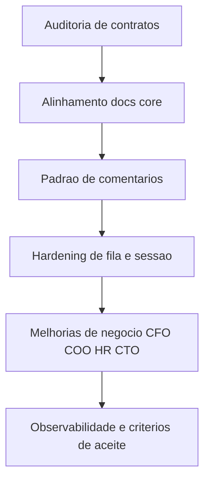

# Projeto — Auditoria de Documentação + Features de Lógica e Regra de Negócio

## 1. Objetivo

Executar primeiro uma auditoria completa de precisão documental para desenvolvedor e agente de manutenção e, em seguida, transformar os gaps em um projeto de melhorias de lógica e regra de negócio.

Arquivos-base auditados:
- [AGENTS.md](../AGENTS.md)
- [README.md](../README.md)
- [ARCHITECTURE.md](../ARCHITECTURE.md)
- [BUSINESS.md](../BUSINESS.md)
- [ENDPOINTS.md](../ENDPOINTS.md)
- [UI.md](../UI.md)
- [modules/TaskQueue.js](../modules/TaskQueue.js)
- [modules/GameClient.js](../modules/GameClient.js)
- [modules/StateManager.js](../modules/StateManager.js)
- [modules/Planner.js](../modules/Planner.js)

---

## 2. Diagnóstico de Precisão Documental

### 2.1 Achados críticos

1. Contrato HTTP diverge entre docs e implementação
- Em [ENDPOINTS.md](../ENDPOINTS.md), existe regra forte de URL com query obrigatória em POST.
- Em [modules/GameClient.js](../modules/GameClient.js), parte das ações usa POST direto em `/index.php` com body form-encoded.
- Impacto: agente pode implementar payload correto no corpo e errar o contexto de URL.

2. Organização por fases de decisão está no código, mas fraca na doc principal
- [modules/Planner.js](../modules/Planner.js) já governa ciclo por fases com `PlannerContext`.
- [ARCHITECTURE.md](../ARCHITECTURE.md) ainda enfatiza fluxo linear por módulo e não centraliza o contrato do planner como fonte operacional.
- Impacto: manutenção pode adicionar trigger direto em módulos e quebrar ordem de prioridade.

3. Modelo de tarefa evoluiu além da documentação
- [modules/TaskQueue.js](../modules/TaskQueue.js) já usa `TASK_PHASE`, deduplicação por fase, watchdog, política de tentativa para GUARD.
- [BUSINESS.md](../BUSINESS.md) e [ARCHITECTURE.md](../ARCHITECTURE.md) ainda descrevem fila de forma mais simples.
- Impacto: decisão errada sobre retry, prioridade e convivência de tasks por cidade.

4. Estado e cidade ativa têm semântica refinada no código e parcial na doc
- [modules/StateManager.js](../modules/StateManager.js) diferencia cidade ativa local, cidade ativa no servidor e comportamento durante probing.
- Isso não está explicitado como invariantes obrigatórios em um bloco único de documentação.
- Impacto: mudanças em navegação e coleta podem causar dessíncrono sessão-servidor.

### 2.2 Achados de consistência média

1. [UI.md](../UI.md) está robusto, mas não referencia explicitamente o contrato atualizado de estados da fila por fase.
2. [README.md](../README.md) é bom como roteador, mas falta seção curta de versão de contrato documental e status de aderência código-doc.
3. [AGENTS.md](../AGENTS.md) é ótimo como índice, mas pode ganhar checklist operacional de validação de divergência doc x código.

---

## 3. Revisão de Comentários no Código

### 3.1 Manter
- Comentários de invariantes e armadilhas de protocolo em [modules/GameClient.js](../modules/GameClient.js).
- Comentários de prioridade de fase e preempção em [modules/TaskQueue.js](../modules/TaskQueue.js).
- Comentários do ciclo e wake-up adaptativo em [modules/Planner.js](../modules/Planner.js).
- Comentários de heurísticas sensíveis em [modules/StateManager.js](../modules/StateManager.js).

### 3.2 Reescrever
- Comentários longos com histórico de bug dentro de módulo produtivo em [modules/CFO.js](../modules/CFO.js).
- Comentários que repetem o óbvio do código sem agregar contrato em [modules/COO.js](../modules/COO.js).
- Comentários de contexto de produto misturados com detalhe técnico em [modules/Config.js](../modules/Config.js).

### 3.3 Remover
- Comentários de seção puramente visual ou separadores extensos sem semântica.
- Notas redundantes quando já cobertas por teste unitário com nome claro.

### 3.4 Padrão futuro de comentário
- Comentário só entra quando documenta:
  - Invariante de domínio
  - Contrato externo do jogo
  - Motivo de decisão não óbvia
  - Mitigação de bug recorrente

---

## 4. Projeto de Features e Melhorias de Lógica e Regra de Negócio

## 4.1 Linha mestra

Primeiro resolver precisão documental, depois usar o mesmo mapa de gaps para destravar evolução funcional sem regressão de regra.

## 4.2 Backlog priorizado

### Bloco A — Precisão Documental

1. Contrato único de requests
- Criar seção canônica em [ARCHITECTURE.md](../ARCHITECTURE.md) referenciando [ENDPOINTS.md](../ENDPOINTS.md) e comportamento real em [modules/GameClient.js](../modules/GameClient.js).
- Critério de aceite: todo endpoint usado no código tem caminho de execução descrito.

2. Contrato de ciclo de decisão
- Documentar [modules/Planner.js](../modules/Planner.js) como orquestrador central e declarar anti-padrão de trigger paralelo.
- Critério de aceite: cada módulo de negócio com trigger delegado ao planner está explícito em doc.

3. Contrato de task lifecycle
- Atualizar documentação com `phase`, deduplicação por fase, watchdog, política de tentativas GUARD.
- Critério de aceite: matriz estado da task cobre pending, in-flight, blocked, failed, done, guard cancel.

4. Matriz de aderência doc x código
- Adicionar tabela viva em [README.md](../README.md) com status por contrato crítico.
- Critério de aceite: divergência nova passa a ser rastreável em revisão.

### Bloco B — Comentários e Legibilidade Técnica

1. Normalizar comentários por padrão de valor
- Keep rewrite remove nos módulos críticos.
- Critério de aceite: redução de comentários redundantes e aumento de comentários contratuais.

2. Migrar histórico de bug para documentação de manutenção
- Tirar histórico disperso do código quando não é invariante.
- Critério de aceite: histórico consultável fora do fluxo principal do módulo.

### Bloco C — Features de Lógica e Regra de Negócio

1. Política de affordance do CFO mais realista
- Refinar [modules/CFO.js](../modules/CFO.js) para considerar custo total em recursos + impacto de ouro projetado com envelope de risco.
- Critério de aceite: build aprovado com explicação de viabilidade multi-recurso.

2. COO com logística multi-fonte mais previsível
- Evoluir ledger e heurística de origem em [modules/COO.js](../modules/COO.js) para minimizar starvation entre cidades.
- Critério de aceite: deficits simultâneos não causam sobrealocação.

3. HR com política anti-oscilação parametrizada por cidade
- Consolidar piso dinâmico de vinho e histerese por perfil urbano.
- Critério de aceite: ausência de loop sobe-desce em ciclos curtos.

4. CTO com fila de pesquisa orientada a impacto econômico real
- Priorizar pesquisa por ganho econômico marginal e bloqueios atuais do império.
- Critério de aceite: escolha de pesquisa justificada por contexto de produção e custo.

### Bloco D — Confiabilidade Operacional

1. Hardening de sessão ativa
- Fortalecer invariantes de cidade ativa entre [modules/StateManager.js](../modules/StateManager.js) e [modules/GameClient.js](../modules/GameClient.js).
- Critério de aceite: nenhuma ação com `currentCityId` inconsistente após probing.

2. Auditoria orientada a decisão
- Estruturar eventos de decisão para análise de causa raiz em [modules/Audit.js](../modules/Audit.js).
- Critério de aceite: cada task relevante contém trilha de origem e bloqueador.

---

## 5. Sequência de Execução para modo Code

1. Atualizar documentação canônica de contratos
2. Aplicar revisão de comentários nos módulos críticos
3. Ajustar regras de negócio CFO COO HR CTO
4. Endurecer invariantes de sessão e fila
5. Atualizar testes unitários focados por módulo
6. Rodar suíte e registrar matriz final de aderência

---

## 6. Entregáveis esperados

1. Documentação alinhada e auditável para dev e agente
2. Código com comentários de alta utilidade e baixo ruído
3. Roadmap de evolução lógica com critérios de aceite técnicos
4. Base pronta para implementação controlada em modo Code

