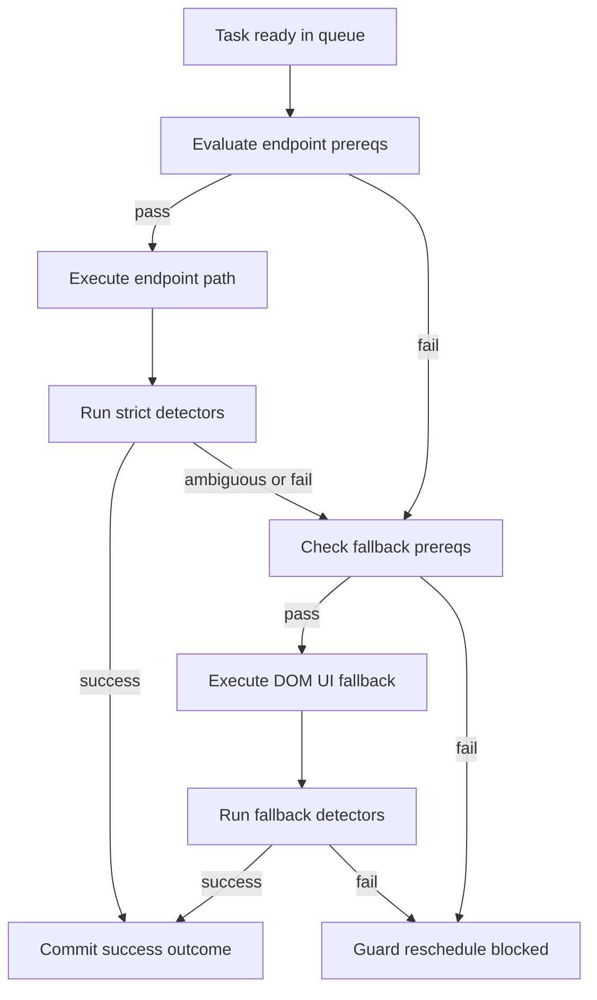

# Hybrid Endpoint-First + DOM/UI Fallback Strategy

## 1) Problem framing

The current runtime already has a strong endpoint execution core (`TaskQueue` + `GameClient`) and robust response interception (`inject` + `DataCollector`).

The core limitation is not just transport format; it is **execution context dependency**:

- some actions are reliably executable by endpoint flow when context and token are valid
- some actions/data require server-rendered HTML and/or live DOM state to derive mandatory fields
- some flows appear endpoint-callable but still depend on UI-side intermediate state

This proposal keeps endpoint-first behavior, but formalizes deterministic fallback and safety so production behavior remains stable.

---

## 2) Decision matrix

### 2.1 Path policy (approved posture)

- **Balanced policy** for unknown/partially mapped actions:
  1. try endpoint path first with strict validation
  2. fallback to DOM/UI path if endpoint preconditions are not met or response is non-committal
  3. if neither path is safe, requeue as guard (never blind-fire)

### 2.2 Per-action route classification

Define a capability table per action type:

- **Endpoint-only**: action fully deterministic via request + response contracts
- **Endpoint+HTML**: action dispatched by endpoint, but requires HTML extraction from prior response
- **DOM-assisted**: requires live DOM state after UI render
- **UI-only/manual-blocked**: no safe automated contract yet

Initial mapping from current code/docs:

- BUILD upgrade: **Endpoint+HTML** (level/token/context strictness)
- TRANSPORT: **Endpoint+HTML/DOM-assisted** (context + route fields, journey-time nuance)
- WINE_ADJUST: **Endpoint+HTML** (tavern context first)
- RESEARCH start: **Endpoint+HTML** (advisor link extraction)
- WORKER_REALLOC scientists: **Endpoint+HTML**
- unresolved actions listed in endpoint gaps: **UI-only/manual-blocked until mapped**

### 2.3 Detailed capability matrix

The matrix below makes path selection explicit for runtime and review.

| Action family | Capability class | Endpoint prerequisites | HTML prerequisites | Live DOM prerequisites | Success detectors | Hard-fail detectors | Fallback policy |
|---|---|---|---|---|---|---|---|
| BUILD upgrade | Endpoint+HTML | fresh token, city context lock, target slot | parse `upgradeHref` with current `level`, parse `actionRequest` refresh | optional for visual confirmation only | `provideFeedback` success, no `confirmResourcePremiumBuy`, expected construction delta | `confirmResourcePremiumBuy`, queue occupied, invalid level token pair | do not use DOM write fallback; guard and reschedule |
| TRANSPORT send | Endpoint+HTML then DOM-assisted observe | origin city lock, destination ids, transporter availability | parse destination `islandId`, `max_capacity`, form context | read live mission/eta consistency when needed | feedback success, `freeTransporters` delta, mission appears in military list | no transporter delta, missing mission, explicit server error feedback | fallback allowed only for state acquisition, not blind write |
| TRANSPORT abort | Endpoint-only | valid `eventId`, city context lock, fresh token | none | optional check mission removed | abort feedback plus mission disappearance | event not found, mission still present after retry window | no DOM write fallback; guard with reason code |
| WINE adjust tavern | Endpoint+HTML | city lock, tavern position | parse valid `amount` range from tavern context | optional inspect satisfaction side effects | wine spending change or expected stable state at same index | invalid amount, no state transition | fallback to re-open tavern context then retry endpoint |
| WORKER realloc academy | Endpoint+HTML | city lock, fresh token | parse worker form shape and max bounds | optional read displayed worker counters | worker totals changed to requested values and research/gold effects coherent | bounds violation or unchanged workers after success claim | fallback to context refresh only |
| WORKER realloc townHall | Endpoint+HTML and DOM-assisted bounds | city lock, fresh token | parse workerPlan form in townHall context | read `input*` and `data-max` constraints before write | worker distribution changed and downstream production updated | invalid combination rejected by server, no worker delta | fallback allowed for DOM bounds re-read then endpoint retry |
| RESEARCH start switch | Endpoint+HTML | city lock, fresh token | parse advisor link and category route | optional progress widget read | feedback success and active research context changed | insufficient points or no category transition | fallback only to re-open advisor context |
| CULTURAL assign museum | Endpoint+HTML | city lock, fresh token | parse assign form and city goods fields | optional free goods display check | feedback success and goods distribution delta | inconsistent totals or missing assign fields | fallback to form refresh then endpoint retry |
| MARKET offers update | Endpoint+HTML | city lock, fresh token | parse complete offer field set | optional tab state check | feedback success and offer table reflects posted set | partial field set, silent no-op | fallback to reopen own-offers tab then retry endpoint |
| MILITARY advisor monitor | DOM-assisted read | none for write path | optional viewscript extraction from response | parse movement table and action links in live DOM | mission rows parsed with stable ids and eta | selector miss, malformed row payload | no write, degrade to guarded monitoring mode |
| TRADE routes premium edit | UI-only manual-blocked until confirmed | premium eligibility, fresh token | parse premium form shape | verify premium UI constraints | successful route activation state change | premium denial, incomplete form state | keep blocked until deterministic write contract is validated |

#### Matrix operating rules

1. Endpoint write is the only allowed side-effect path unless capability explicitly states otherwise.
2. HTML and DOM layers are considered evidence layers for prerequisites and detectors.
3. When detectors disagree, outcome is `guard-reschedule` and never `success`.
4. Any selector miss on DOM-assisted paths emits `hybrid:selector_miss` and downgrades confidence.
5. UI-only/manual-blocked actions remain blocked until request shape and detector set are both validated.

---

## 3) Proposed design

### 3.1 New hybrid execution abstraction

Introduce an execution strategy layer inside request orchestration (no module ownership changes):

- `actionSpec` with:
  - `actionType`
  - `preferredPath`: endpoint-first
  - `endpointPrereqs` and `fallbackPrereqs`
  - `successDetectors`
  - `failureDetectors`
  - `retryPolicy`

`TaskQueue` remains scheduler/guard executor; `GameClient` remains network authority; hybrid selector sits as an internal strategy registry consumed during dispatch.

### 3.2 Path selection algorithm

For each task dispatch:

1. evaluate endpoint prereqs from state + token + context freshness
2. if satisfied, execute endpoint path
3. evaluate response against strict success/failure detectors
4. if inconclusive and fallback allowed, acquire DOM/UI fallback route and execute
5. if fallback unavailable/unsafe, return guard-reschedule with reason code

### 3.3 State/contracts required

Add explicit state contract dimensions to support both paths:

- `pathDecision`: endpoint or fallback, plus decision reason
- `dataProvenance`: endpoint, html-response, live-dom, inferred
- `contextLock`: city/session/view lock evidence at decision time
- `tokenSnapshot`: token age/source when request prepared
- `routeConfidence`: HIGH/MEDIUM/LOW derived from provenance + freshness

These should be attached to task evidence/audit entries and available to UI read model.

### 3.4 Unified action outcome contract

Standardize per-attempt outcome object:

- `attemptId`, `taskId`, `pathUsed`
- `prereqCheck` result
- `requestShapeHash` and key params snapshot
- `responseSignals` detected
- `outcomeClass`: success, hard-fail, guard-reschedule, fallback-triggered
- `nextStep`

This gives deterministic replay and post-mortem behavior without changing business module intent.

---

## 4) Failure modes + mitigations

1. **False success from ambiguous response**
   - Mitigation: strict multi-signal success detectors (feedback + structural command + expected state delta)

2. **Session drift between city/context and payload**
   - Mitigation: enforce guard + session lock + context snapshot in evidence before dispatch

3. **Fallback loops**
   - Mitigation: per-task path budget and fallback-attempt cap; then guard-reschedule/fail with explicit code

4. **DOM selector drift**
   - Mitigation: selector capability versioning, canary checks, and fast demotion to endpoint-only/blocked mode

5. **Token/context expiration between steps**
   - Mitigation: mandatory refresh checkpoints and immediate token provenance logging before write calls

6. **Silent production degradation**
   - Mitigation: path ratio metrics and alert thresholds for fallback spikes and guard inflation

---

## 5) Observability, audit, replay

### 5.1 Required telemetry additions

- path decision events (`endpoint`, `fallback`, `guard`)
- prereq evaluation results
- detector outcomes and ambiguity flags
- replay bundle references (request/response summaries + DOM extraction fingerprints)

### 5.2 Audit/replay model

Use existing audit/event stack but add normalized hybrid events:

- `hybrid:path_decided`
- `hybrid:attempt_outcome`
- `hybrid:fallback_invoked`
- `hybrid:selector_miss`

Replay should rebuild a deterministic timeline per task attempt without raw full payload dependency.

### 5.3 UI safety surfacing

Expose in UI read model:

- path used on latest attempts
- ambiguity/fallback badges
- top blocker reason codes
- production safety mode status

---

## 6) Incremental rollout phases

### Phase 0 — Contract + instrumentation only

- no behavior changes
- introduce path decision schema and attempt outcome logging
- acceptance:
  - every task dispatch has path decision record
  - no regression in existing task success baseline

### Phase 1 — Endpoint strict validators

- add success/failure detectors to existing endpoint flows
- acceptance:
  - ambiguous outcomes do not resolve as success
  - guard reason codes emitted for all inconclusive writes

### Phase 2 — Controlled fallback on selected actions

- activate fallback for BUILD, TRANSPORT, RESEARCH, WINE_ADJUST, WORKER_REALLOC
- acceptance:
  - fallback only when prereqs pass
  - fallback invocation rate observable and bounded
  - no duplicate side effects for same task attempt

### Phase 3 — Safety hardening + rollout controls

- feature flags per action and per path
- canary rollout with automatic rollback triggers
- acceptance:
  - kill-switch works without reload
  - fallback spike triggers degradations/alerts

### Phase 4 — Broader action coverage

- migrate additional unresolved actions from blocked to mapped as contracts are validated
- acceptance:
  - each new action ships with decision table + tests + audit signals

---

## 7) Test strategy

### 7.1 Unit

- decision engine:
  - endpoint eligible/ineligible branches
  - ambiguous response classification
  - fallback gate and cap behavior
- detector tests per critical action
- provenance/state contract serialization tests

### 7.2 Integration (module interaction)

- TaskQueue guard -> GameClient endpoint -> fallback -> outcome mapping
- session lock correctness with probing in progress
- ensure no duplicate dispatch when fallback triggered

### 7.3 Replay/observability tests

- reconstruct task attempt timeline from audit events
- assert reason codes and path labels present
- verify UI model receives path/outcome fields

### 7.4 Acceptance tests for rollout gates

- endpoint success remains primary path for mapped stable actions
- fallback engages only on detector-approved conditions
- unknown write actions remain guarded/blocked, not auto-fired

---

## 8) Concrete implementation mapping in current codebase

### Core execution and path strategy

- `modules/GameClient.js`
  - add hybrid strategy registry + strict detectors
  - normalize attempt outcome object
  - preserve single egress responsibility

- `modules/TaskQueue.js`
  - extend dispatch contract to carry path decision metadata
  - treat fallback exhaustion as guarded outcome, not silent retry
  - keep phase/prioritization semantics unchanged

### Data acquisition and provenance

- `modules/DataCollector.js`
  - tag extracted data provenance (`header`, `changeView`, `dom`)
  - emit normalized evidence for hybrid detectors

- `modules/StateManager.js`
  - store freshness/provenance facets required by path prereq checks
  - expose helper selectors for decision engine

### Bridge and UI contracts

- `modules/Events.js`
  - add hybrid event constants for path decisions/outcomes

- `modules/UIBridge.js`
  - project new path/outcome/blocker fields into UI state

- `UI.md`
  - update `TaskView`/alerts contract with path and ambiguity badges

### Runtime wiring / fallback hooks

- `inject/inject.js`
  - keep early interception invariant
  - wire fallback capability flag bootstrap

- `content/content.js`
  - no major logic change; preserve bridge contract

### Business modules integration points (no planning ownership change)

- `modules/CFO.js`, `modules/COO.js`, `modules/CTO.js`, `modules/CSO.js`
  - no direct network calls introduced
  - optionally enrich emitted task evidence with action intent requirements

### Audit and production safety

- `modules/Audit.js`
  - add hybrid event indexing helpers and aggregate counters

### Docs alignment

- `ARCHITECTURE.md`
  - add hybrid execution subsection and invariants
- `ENDPOINTS.md`
  - annotate action capability class and fallback requirements
- `GAME_MODEL.md`
  - annotate provenance reliability by field for decision engine
- `SCRAPER.md`
  - map selectors used by fallback detectors and drift risk

### Tests to add/extend

- extend: `tests/unit/taskqueue_orchestration.test.js`
- extend: `tests/unit/taskqueue_guard_attempt_policy.test.js`
- extend: `tests/unit/taskqueue_transport_guards.test.js`
- extend: `tests/unit/audit.test.js`
- add: hybrid decision engine tests near `tests/unit/`
- add: `UIBridge` projection assertions for new path/outcome fields

---

## 9) Mermaid overview

---

## 10) Immediate next implementation steps

1. Add hybrid path decision schema and outcome contract in execution layer.
2. Implement strict detector library for BUILD, TRANSPORT, RESEARCH, WINE_ADJUST, WORKER_REALLOC.
3. Add provenance/freshness selectors in state for prereq checks.
4. Emit new hybrid events and wire audit counters.
5. Project path/outcome/blocker fields into UI state.
6. Ship Phase 0 and Phase 1 behind feature flags.
7. Enable Phase 2 fallback only for one action at a time in canary order.
