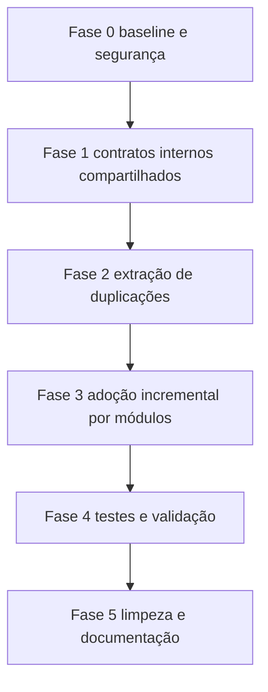

# Plano Técnico — Refatoração Média

## Objetivo

Padronizar código e reduzir duplicação em módulos centrais, mantendo contratos e APIs públicas atuais.

## Escopo

### Incluído

- Consolidar estruturas repetidas de recursos em utilitário compartilhado
- Consolidar mapeamentos repetidos de recursos e payloads de transporte
- Padronizar helpers assíncronos de espera e pequenas rotinas utilitárias duplicadas
- Padronizar normalização de dados de cidade e recursos entre cache e estado
- Reforçar cobertura de testes para garantir comportamento equivalente

### Excluído

- Mudança de comportamento funcional de negócio
- Alteração de contratos públicos consumidos por UI e orquestração
- Refatoração ampla de arquitetura de camadas
- Reescrita de módulos não impactados por duplicação relevante

## Hotspots confirmados

- Estruturas repetidas de recursos em COO, StateManager e ResourceCache
- Mapeamentos de tradegood e campos de cargo repetidos em Port e GameClient
- Helpers de delay e sleep com implementação paralela em utils e ResourceCache
- Trechos de normalização e fallback de dados com padrão similar em StateManager e ResourceCache

## Estratégia em fases

### Fase 0 — Baseline e segurança

1. Congelar baseline de testes atuais
2. Identificar pontos de entrada públicos por módulo alvo
3. Registrar casos críticos para não regressão

### Fase 1 — Contratos internos compartilhados

1. Criar utilitário interno para shape de recursos padrão
2. Criar mapeamentos compartilhados para:
   - chave de recurso para payload de transporte
   - chave de servidor para recurso interno
   - ordinal de tradegood para recurso
3. Definir convenções de nomenclatura para entidades de recursos

### Fase 2 — Extração de duplicações

1. Substituir objetos literais repetidos por fábricas utilitárias
2. Centralizar mapeamentos de cargo e tradegood
3. Padronizar helper de espera assíncrona
4. Extrair transformações comuns de snapshot e atualização de recursos

### Fase 3 — Adoção incremental por módulos

Ordem recomendada de baixo risco para alto impacto:

1. modules/utils.js
2. modules/Port.js e modules/GameClient.js
3. modules/ResourceCache.js
4. modules/StateManager.js
5. modules/COO.js

### Fase 4 — Testes e validação

1. Ajustar testes existentes para refletir extrações internas sem alterar comportamento
2. Adicionar testes novos para utilitários compartilhados
3. Adicionar testes unitários obrigatórios para mapeamentos compartilhados
   - recurso para campo de cargo
   - chave de servidor para recurso interno
   - ordinal de tradegood para recurso
4. Rodar suíte unitária completa e focada por módulo alterado
5. Validar ausência de quebra de assinatura pública

### Fase 5 — Limpeza e documentação

1. Remover duplicações remanescentes pequenas
2. Atualizar documentação técnica curta sobre novos utilitários internos
3. Registrar decisões de padronização para próximas mudanças

## Riscos e mitigação

### Risco 1

Mudança acidental de contrato interno com efeito indireto em módulos de negócio.

Mitigação:

- Adotar migração incremental por módulo
- Preservar assinatura de métodos públicos
- Cobrir com testes antes e depois de cada bloco

### Risco 2

Refatoração transversal gerar diffs grandes e difíceis de revisar.

Mitigação:

- Separar em lotes pequenos por domínio de duplicação
- Commits temáticos por fase
- Evitar mexer em formatação fora do necessário

### Risco 3

Centralização excessiva criar utilitário genérico demais e pouco legível.

Mitigação:

- Criar utilitários específicos de domínio
- Nomear funções por intenção de negócio técnico
- Manter documentação curta por módulo compartilhado

## Critérios de aceite

- APIs públicas preservadas
- Comportamento funcional equivalente ao baseline
- Redução perceptível de blocos duplicados nos módulos alvo
- Testes unitários verdes com cobertura mantida ou melhorada
- Testes unitários dos mapeamentos compartilhados criados e obrigatoriamente verdes
- Plano executável em etapas independentes por modo code

## Sequência de execução recomendada no modo code

1. Criar utilitários compartilhados mínimos
2. Migrar Port e GameClient para mapeamentos únicos
3. Migrar ResourceCache para fábricas e helpers comuns
4. Migrar StateManager e COO para os mesmos contratos internos
5. Revisar testes e validar suíte completa

